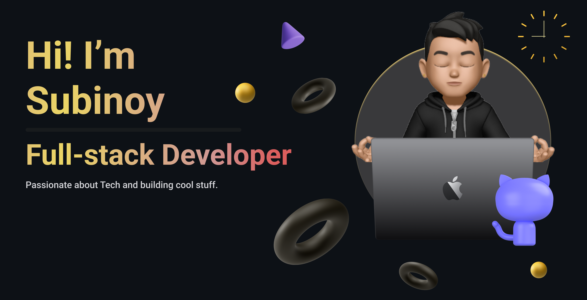

# 💫 About Me:
- 🏢 Intern @ [Invisible Studios](https://invisible.af)
- 💻 Ex-Fullstack Intern @ [PlayTheory Labs](https://playtheory.xyz)
- 🏗️ Founder @ [DevDotCom](https://www.devdotcom.tech/)
- 👥 Core Team Member @ [GDG Kolkata](https://gdg.community.dev/gdg-kolkata/)
- 🧑‍🎓 Student of Computer Science and Enginnering
- 🥇 Winner of [StatusCode0(MLH Hackathon)](https://devfolio.co/statuscode0/dashboard)

# 🤹‍♂️ Skills:
- Typescript, Javascript, Go, Python, C++, C
- Nodejs, Flask 
- Nextjs, Reactjs, React Native, Threejs
- Supabase, MongoDB, FireStore, PostgreSQL, MySQL
- AWS, Azure, Vercel, GCP
+ ...get to know me first;)

# 🌐 Socials:
  

[...more](https://linktr.ee/heysubinoy)

# 📊 GitHub Stats:

# 💻 Tech Stack:

